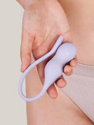

One of the definite turn offs of giving birth is the possibility of losing strength in your pelvic floor. Pregnancy is of course not the only way a pelvic floor can weaken, as we age we could probably expect to have little accidents as we laugh and sneeze.

While keeping your pants dry is the common motivator for healthy pelvic floor, performing kegels has other benefits like improving your intimate well-being.

However if there was anyway I could delay that and strengthen my pelvic floor as I considered becoming pregnant, I was going to give it a try.

### Introducing kegel exercisers

Have you heard of Fem-tech? [Well it is software and services that use technology tailored towards women's health](https://en.wikipedia.org/wiki/Femtech#:~:text=software%20and%20services%20that%20use%20technology%20tailored%20towards%20women%27s%20health). This category in tech requires it’s own deep-dive article (which you can expect) but for now I am mentioning it because the kegel exercisers fall in this category.

I know of two companies that provide this product. Elvie and [Perifit](https://eu.perifit.co/pages/kegel-exercisers). Since 2022 I have had the Perifit kegel exerciser and so that is the review I will give today.

### What is Perifit?

The Perifit is a combination of :

1. Hardware- a cylindrical silicone product which is inserted into the body. The product I have comes in one size and is not adapted to all anatomies. In general it does not hurt to use and doesn’t go further than a tampon.

2. Software- an app that you download which has multiple games, exercises and content about pelvic health. You are able to practise the perfect kegel so that you can train effectively. With each game and exercise your pelvic floor is assessed according to strength, endurance, contraction quality, speed and control.

### How it works

Ok so as simple as it is, it is also not that simple. For multiple reasons, inserting strange objects in our most intimate areas is not something we do without thinking twice. But that’s how it starts.

After downloading the app and creating a profile, The Perifit device is connected to the app via bluetooth. You then get into a comfortable position- I prefer to lie down and then insert the device. The first time you use it (or after a long time) you will be prompted to customize your training program.

After you have done that (you can also skip that part) you can go to the exercises tab and pick a game .
Each game has different levels of difficulty. And with the help of your program you are able to play according to the recommended level. Each time you start, the game is explained to you.

<video width="300"
controls src="https://assets.tina.io/58ac3314-0244-4e69-bba8-18ba7596d101/perifit_vlog.MP4" title="Perifit-demonstration"></video>

### Do I recommend?

Take this recommendation with a pinch of salt because I am quite keen to try most innovations out there. At the time I bought this I was preparing for pregnancy- which meant I was willing to spend a little bit more than usual if I believed it would benefit my overall health.
Using Perifit helped me learn how to control my pelvic floor and determine if I was doing them right. And to be honest that is what I focus on when I play the games. Am I controlling my pelvic floor the way I should- pinching and relaxing the right way.

If you don’t have existing problems (incontinence, urine leaking) I think you can live without it. Continue doing your own pelvic floor exercises without the added cost.

I took a long break from using it after birth because I just didn’t prioritise it (You are able to use it 6 weeks after birth). I was happy to see the updates in the app. It’s really great that they are continuously making changes and improving the user experience. These days, you don’t often buy something and can use it long-term without additional costs but that’s what I have now. I have not had to spend another cent since buying it and still have access to all its features.
